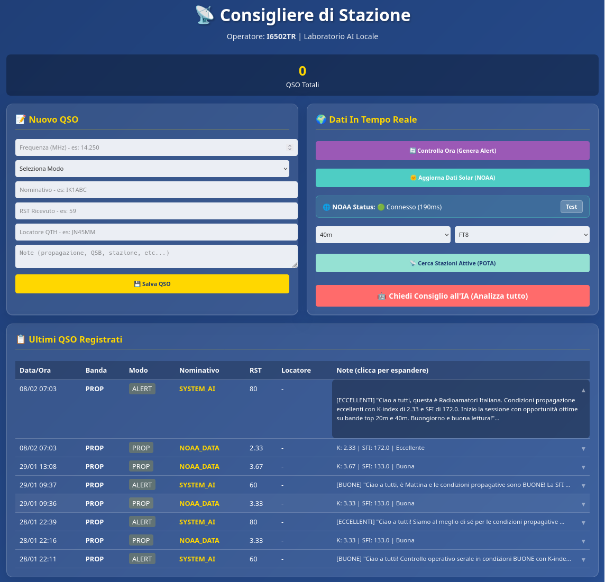

# Consigliere di Stazione 🇮🇹📡

*Made in Italy by I6502TR*

---

## 📻 Cos'è?

Il Consigliere di Stazione è quello che avevi in shack prima del computer: il socio esperto che guardava il K-index sul giornale e sapeva già che i 20 metri stavano per aprirsi.

Fa esattamente quello, ma in digitale. Registra i QSO, scarica i dati solari da NOAA, controlla l'attività POTA in tempo reale, e ti dice cosa fare con tutto questo. Senza mandare nulla da nessuna parte.

**Nessun cloud. Nessun abbonamento. I tuoi log restano nello shack.**

---

## 🖼️ L'interfaccia



Tasti grandi, colori che si leggono con qualsiasi luce, layout che non richiede manuale. Se sai accendere un computer, lo usi.

---

## ✨ Cosa fa

**Quaderno di bordo** — frequenza, modo, nominativo, RST, locatore QTH, note libere. La banda la calcola da sola. Ogni contatto ha il suo timestamp. Il tuo nominativo operatore si imposta cliccando direttamente sulla scritta in cima alla pagina — niente file da editare.

**Dati NOAA** — K-index e Solar Flux Index aggiornati con un click. Puoi confrontare un ascolto difficile di tre giorni fa con le condizioni solari di quel momento esatto.

**Il Consigliere** — legge i tuoi log, prende i dati NOAA e l'attività POTA e ti dice dove e quando ascoltare. Funziona con Ollama (AI locale, niente dati in giro). Se Ollama non è installato, i consigli vengono generati comunque dai dati solari in automatico.

**Stazioni attive (POTA)** — chi sta trasmettendo adesso, su quale banda, in quale parco. Filtrabile per banda e modo.

---

## 🔒 Privacy

Non c'è un server. Non c'è un account. Non c'è niente da pagare.

I QSO finiscono in un file SQLite sul tuo disco. Nient'altro.

---

## 🚀 Installazione

### Windows

1. Vai nella sezione [Releases](../../releases) e scarica `ConsigliereDiStazione-v1.0.zip`
2. Estrai la cartella dove vuoi (Desktop, Documenti...)
3. Doppio click su `ConsigliereDiStazione.exe`
4. Il browser si apre da solo su `http://localhost:8080`

Python non serve. Non bisogna installare niente.

Per fermare il programma, chiudi la finestra nera che rimane aperta.

### Linux / Raspberry Pi

```bash
git clone https://github.com/111blackeagle111/consigliere-di-stazione.git
cd consigliere-di-stazione
pip install -r requirements.txt
python src/main.py
```

Se vuoi il Consigliere AI con Ollama:

```bash
curl -fsSL https://ollama.com/install.sh | sh
ollama pull llama3.2
```

Senza Ollama funziona lo stesso — i consigli si basano sui dati NOAA.
