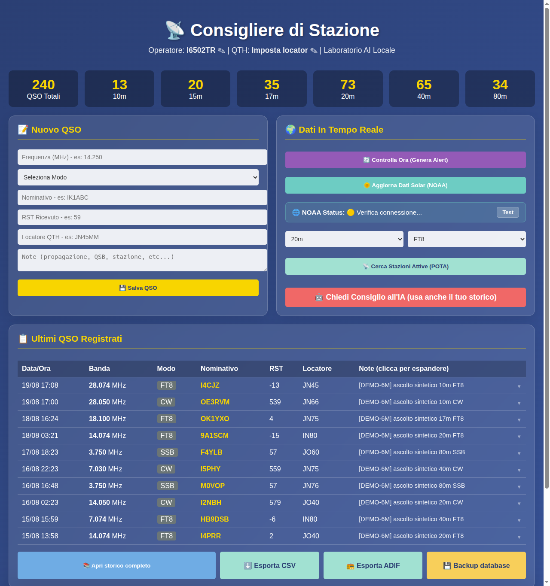
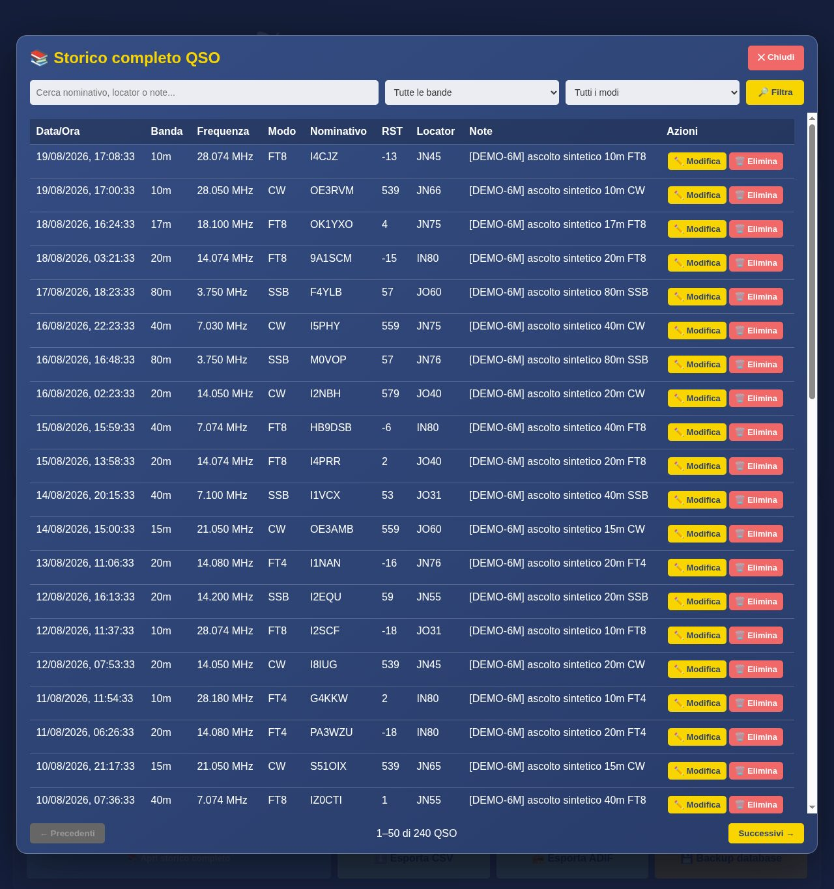

# Consigliere di Stazione 🇮🇹📡

*Made in Italy by I6502TR*

---

## 📻 Cos'è?

Il Consigliere di Stazione è quello che avevi in shack prima del computer: il socio esperto che guardava il K-index sul giornale e valutava se valeva la pena provare i 20 metri.

Fa esattamente quello, ma in digitale. Registra i QSO, scarica i dati solari da NOAA, controlla l'attività POTA in tempo reale su tutte le bande e combina questi dati con il tuo intero storico operativo. I dati del registro non vengono inviati a servizi esterni.

**Nessun cloud. Nessun abbonamento. I tuoi log restano nello shack.**

---

## 🖼️ L'interfaccia



Tasti grandi, colori che si leggono con qualsiasi luce, layout che non richiede manuale. Se sai accendere un computer, lo usi.

Lo storico completo viene caricato soltanto quando serve, con ricerca, filtri per banda e modo e 50 QSO per pagina:



*Le schermate usano dati sintetici marcati `[DEMO-6M]`; non rappresentano collegamenti reali.*

---

## ✨ Cosa fa

**Quaderno di bordo** — frequenza, modo, nominativo, RST, locatore QTH, note libere. La banda la calcola da sola. Ogni contatto ha il suo timestamp. Il tuo nominativo operatore si imposta cliccando direttamente sulla scritta in cima alla pagina — niente file da editare.

**Storico completo** — gli ultimi dieci QSO restano visibili nella dashboard; l'archivio completo si apre su richiesta e permette di cercare nominativi, locator e note, filtrare banda e modo e scorrere 50 record per pagina. I record tecnici NOAA e gli alert non vengono mescolati ai QSO.

**Dati NOAA** — K-index e Solar Flux Index aggiornati con un click. Puoi confrontare un ascolto difficile di tre giorni fa con le condizioni solari di quel momento esatto.

**Il Consigliere** — analizza localmente **tutti** i QSO presenti nel database, senza limiti temporali o numerici, insieme a K-index, SFI e attività POTA reale su tutte le bande. Usa il servizio locale swlbot RAG, che unisce i dati correnti al corpus tecnico del blog. Se il RAG non è disponibile prova Qwen locale senza retrieval, mostrando un avviso; se anche Qwen non risponde passa al motore deterministico.

**Stazioni attive (POTA)** — chi sta trasmettendo adesso, su quale banda, in quale parco. Filtrabile per banda e modo.

### I due controlli AI

- **Controlla Ora (Genera Alert)** legge NOAA e POTA su tutte le bande, valuta le condizioni correnti e salva un alert tecnico. Non usa lo storico QSO.
- **Chiedi Consiglio all'IA (usa anche il tuo storico)** legge NOAA e POTA su tutte le bande e analizza tutti i QSO manuali presenti nel database. Il consiglio non viene salvato come QSO.

Il percorso di generazione è sempre locale:

1. **swlbot RAG + `qwen3.5:4b`** con il corpus tecnico;
2. se il RAG non risponde, **Qwen diretto** vincolato alla valutazione deterministica, con un avviso visibile;
3. se anche Ollama non risponde, **regole locali**.

---

## 🔒 Privacy

Non c'è un server remoto dell'applicazione. Non c'è un account. Non c'è niente da pagare.

I QSO finiscono in un file SQLite sul tuo disco e non vengono inclusi nelle richieste NOAA o POTA. Le uniche comunicazioni esterne dell'app sono le letture dei dati pubblici NOAA e POTA; l'inferenza AI avviene su `localhost` tramite swlbot RAG.

---

## 🚀 Installazione

### Windows

1. Scarica **[ConsigliereDiStazione.exe](https://github.com/111blackeagle111/consigliere-di-stazione/raw/main/ConsigliereDiStazione.exe)**
2. Mettilo dove vuoi (Desktop, Documenti...)
3. Doppio click
4. Il browser si apre da solo su `http://localhost:8080`

Python non serve. Non bisogna installare niente.

Per fermare il programma, chiudi la finestra nera che rimane aperta.

Prima volta? Leggi la **[Guida rapida per Windows](docs/GUIDA_WINDOWS.txt)** — scarica, Windows Defender, primo avvio, backup dei log.

### Linux / Raspberry Pi

```bash
git clone https://github.com/111blackeagle111/consigliere-di-stazione.git
cd consigliere-di-stazione
python3 -m venv .venv
.venv/bin/pip install -r requirements.txt
.venv/bin/python src/main.py
```

Per usare i consigli AI, avvia prima swlbot RAG sulla porta 8081:

```bash
cd ../swl-rag
python server.py
```

In un secondo terminale avvia l'applicazione:

```bash
cd consigliere-di-stazione
.venv/bin/python src/main.py
```

📋 **Requisiti:**
- **RAM:** 4 GB minimi, 8 GB consigliati
- **Disco:** spazio sufficiente per Ollama, il modello e l'indice ChromaDB
- **Testato su:** PC x86_64, Raspberry Pi 4 (4 GB+) e Raspberry Pi 5

Le variabili disponibili sono:

- `SWLBOT_RAG_URL`: endpoint del servizio, predefinito `http://127.0.0.1:8081/api/advice`;
- `SWLBOT_RAG_TIMEOUT`: timeout in secondi, `90` per impostazione predefinita;
- `DIRECT_LLM_URL`: endpoint Ollama diretto, predefinito `http://127.0.0.1:11434/api/chat`;
- `DIRECT_LLM_MODEL`: modello di fallback, predefinito `qwen3.5:4b`;
- `DIRECT_LLM_TIMEOUT`: timeout del fallback diretto, `90` secondi;
- `CONSIGLIERE_DATA_DIR`: directory personalizzata per `swl_logs.db`.

Senza swlbot RAG l'app prova Qwen direttamente e mostra **CONSIGLIO QWEN SENZA RAG**. Se anche Ollama non è disponibile, mostra **CONSIGLIO LOCALE** calcolato con le regole.

## 💾 Database e architettura

SQLite è gestito tramite SQLAlchemy. Durante lo sviluppo il database rimane nella directory del progetto. Le nuove installazioni Windows salvano i dati in `%LOCALAPPDATA%\ConsigliereDiStazione\swl_logs.db`; Linux usa `${XDG_DATA_HOME:-~/.local/share}/consigliere-di-stazione/swl_logs.db`.

Per non nascondere i registri esistenti, l'eseguibile continua a usare automaticamente un vecchio `swl_logs.db` trovato accanto al file `.exe`. Puoi quindi aggiornare senza spostare subito il database.

### Generare uno storico dimostrativo

Per test e screenshot puoi inserire 240 QSO sintetici distribuiti sugli ultimi sei mesi:

```bash
.venv/bin/python scripts/seed_demo_qsos.py
```

Lo script crea prima un backup del database e marca ogni record con `[DEMO-6M]`. Se i dati demo sono già presenti, non li duplica; usa `--replace-demo` soltanto per rigenerarli.

## 📖 Press / Article

[I Built an AI Ham Radio Assistant That Runs Entirely Offline](https://medium.com/@andrea.maccafeo/i-built-an-ai-ham-radio-assistant-that-runs-entirely-offline-because-your-qso-log-is-none-of-992cac4230cf) — Medium
